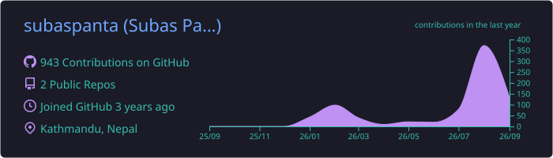

## About

-  Fullstack developer building web applications from frontend interfaces to backend services
-  Working primarily with React and Next.js, with Node.js, PostgreSQL, and MongoDB on the backend
-  Interested in how applications are structured, how data flows through them, and how different pieces fit together
-  Exploring AI and DevOps alongside fullstack development, particularly around AI-assisted workflows, deployment, and infrastructure
-  I enjoy taking an idea from a rough concept to a working product, learning what breaks along the way
-  Currently focused on strengthening my fundamentals, working with real-world codebases, and becoming a better engineer through building
  
## Tech Stack

### Languages & Frameworks

  

### Tools & DevOps

  

## Streak

## Contribution Graph

